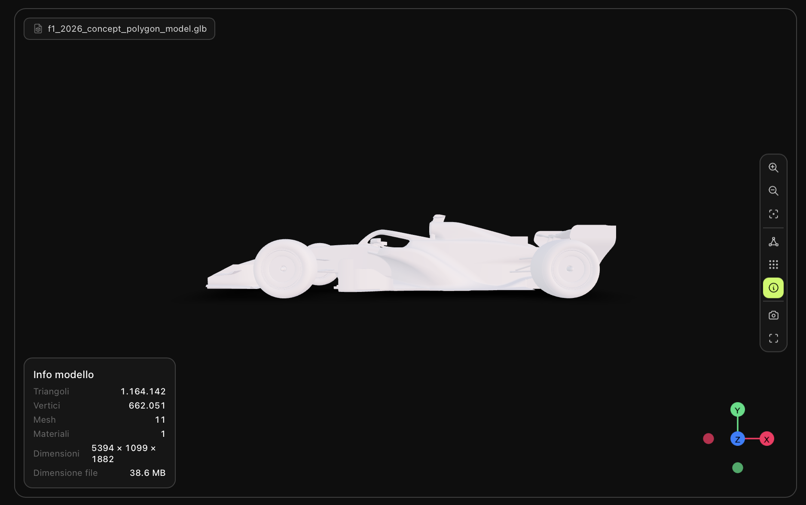

# GLBViewer

A tiny, native macOS 3D **viewer** — one job: open a 3D file and look at it.
No editing, no export, no format conversion.

Built with Swift + SwiftUI + SceneKit.



## Formats

| Path | Formats | Loader |
|------|---------|--------|
| Primary | `.glb` `.gltf` | [GLTFKit2](https://github.com/warrenm/GLTFKit2) (SPM) |
| Secondary | `.obj` `.stl` `.usd` `.usdz` `.usda` `.usdc` `.dae` `.ply` `.abc` | Apple Model I/O |

Both paths converge into a single `SCNScene`, so camera / UI / stats never
need to know where the model came from.

## Features (v1)

- Drag & drop into the window (empty state **and** to replace a loaded model)
- File picker
- Camera orbit / pan / zoom
- Fit-to-view
- Wireframe toggle
- Ground reference grid toggle
- Viewport screenshot → PNG (`NSSavePanel`)
- Fullscreen toggle
- Info panel: triangles, vertices, meshes, materials, bounding-box size, file size, file name
- Colored XYZ axis gizmo (bottom-right) that tracks the camera orientation

## Build

Requires Xcode 16+ (developed on 26.6), macOS 13+.

```sh
xcodebuild -scheme GLBViewer -project GLBViewer.xcodeproj \
  -destination 'platform=macOS' build
```

Or just open `GLBViewer.xcodeproj` in Xcode and hit Run.

## Sandbox

The app runs sandboxed with the **User Selected File (Read Only)** entitlement.
Files opened via drag & drop or the file picker get security-scoped access
automatically; arbitrary paths are (by design) denied.

## Notes

- Draco-compressed geometry and KTX2/BasisU textures are **not** wired up in v1.
  A `.glb` using them will surface a load error rather than a silent failure —
  see the GLTFKit2 README for the extra decoder/xcframework plugins.

## License

MIT.
