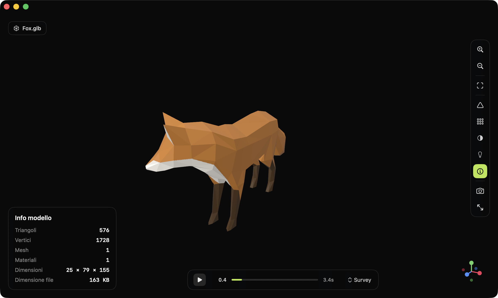
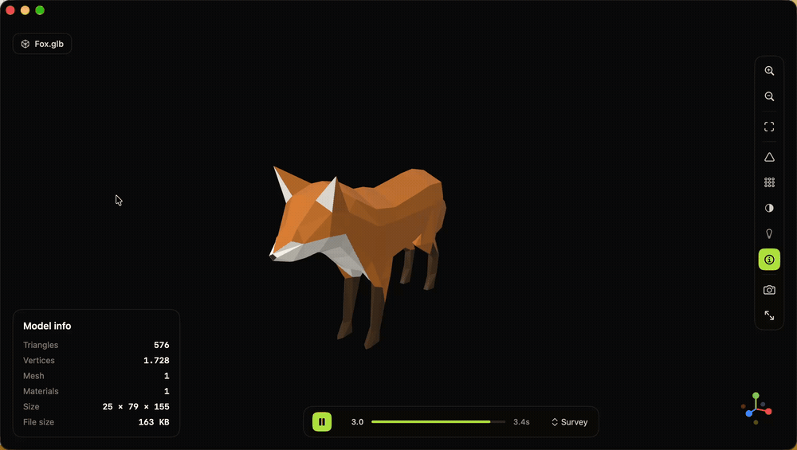

<div align="center">

# Peek3D

**Drop a 3D file. Look at it.**

A tiny, native macOS viewer — no editing, no export, no format conversion.
Free to try on your first 10 files, then **€19.99 once** — no subscription.

[]()
[]()
[](https://github.com/warrenm/GLTFKit2)
[](https://github.com/ufbx/ufbx)
[](https://peek3d.app/buy)
[](LICENSE.md)

[Formats](#formats) · [Features](#features) · [Trial & pricing](#trial--pricing) · [Activation](#activation) · [Build](#build) · [Sandbox](#sandbox) · [Known limits](#known-limits)

</div>





---

## Formats

| Loader | Formats | Animation |
|--------|---------|-----------|
| [GLTFKit2](https://github.com/warrenm/GLTFKit2) (SPM) | `.glb` `.gltf` | Skeletal (skinned) + node-transform |
| [ufbx](https://github.com/ufbx/ufbx) (vendored) | `.fbx` | Node-transform (rigid/hierarchical) |
| Apple Model I/O | `.obj` `.stl` `.usd` `.usdz` `.usda` `.usdc` `.dae` `.ply` `.abc` | — |

All three converge into one `SCNScene`, so the viewer, wireframe, shading
modes, and stats never need to know where a model came from.

## Features

### Viewing
- Drag & drop (empty state **and** to replace a loaded model), or file picker
- Camera orbit / pan / zoom, fit-to-view
- Colored XYZ axis gizmo (bottom-right), click an axis to snap the camera
- Fullscreen toggle
- Viewport screenshot → PNG

### Shading
- **Default** — the file's own materials/textures
- **Normals** — color-coded view-space normals
- **Matcap** — procedural matcap by view-space normal
- **Unlit** — base colour only, no lighting
- **UV checker** — procedural checkerboard on the real UVs
- Wireframe overlay, readable in every shading mode above

### Lighting
- **Default** / **Studio** / **Outdoor** / **Dark mood** presets

### Animation
- Timeline with play / pause and clip selection for animated `.glb`/`.gltf`
  (skinned) and `.fbx` (node-transform) models
- Wireframe stays correct while an animation plays

### Info
- Triangles, vertices, meshes, materials, bounding-box size, file size, file name

### Localization
- English (primary) and Italian, via a native Xcode String Catalog — follows
  the per-app language set in macOS System Settings → General → Language &
  Region. More languages (incl. non-Latin scripts) planned.

## Trial & pricing

Peek3D is free to try, then a one-time purchase — no subscription, ever.

- **Free trial** — open **10 distinct files** before you need a license.
  Reopening a file you've already opened doesn't use up a slot; only
  genuinely new files count. Once the 10 are used, opening any *further new*
  file is blocked until you activate a license — files you already opened
  during the trial stay reachable forever.
- **€19.99, once** — all future updates are included for as long as Peek3D
  exists. You never pay again.
- **Multi-Mac packs** — discounted 2-license and 3-license bundles are
  available for people who use Peek3D on more than one Mac.
- **14-day refund** — not happy? Full refund within 14 days of purchase, see
  the [license FAQ](docs/FAQ.en.md#refunds) for how.

Buy at [peek3d.app/buy](https://peek3d.app/buy). Purchases and payments are
handled by [Polar.sh](https://polar.sh), Peek3D's merchant of record.

## Activation

- One license activates **one Mac**. A multi-license pack lets you activate
  on that many Macs.
- Enter your license key from **Settings ▸ Cambia licenza…** (or the "Ho già
  una licenza" link on the trial screen) — the key is a cryptographically
  signed string, checked entirely **offline**, so activation works with no
  internet connection.
- Once activated, Peek3D periodically re-verifies the license online. If it
  can't reach the verification service (no internet, service down), the app
  keeps working normally for **up to 30 days** since the last successful
  check before it asks you to reconnect.
- Replacing a Mac? Free up its seat yourself before activating on the new
  one — see the [license FAQ](docs/FAQ.en.md) for the exact steps and what
  to do if the old Mac is no longer available.
- Lost your key? Use the in-app "Recover license" flow (or the same on the
  website) with the email you purchased with, and we'll resend it.

Full details, edge cases, and what data activation stores:
[license FAQ](docs/FAQ.en.md) · [FAQ licenza (italiano)](docs/FAQ.it.md) ·
[privacy notice](docs/PRIVACY.en.md) · [informativa privacy (italiano)](docs/PRIVACY.it.md).

## Build

Requires Xcode 16+ (developed on 26.6), macOS 13+.

```sh
xcodebuild -scheme Peek3D -project Peek3D.xcodeproj \
  -destination 'platform=macOS' build
```

Or just open `Peek3D.xcodeproj` in Xcode and hit Run.

## Sandbox

The app runs sandboxed with the **User Selected File (Read Only)** entitlement.
Files opened via drag & drop or the file picker get security-scoped access
automatically; arbitrary paths are (by design) denied. External textures
referenced by an `.fbx`/`.gltf` file (not embedded) need that access too — the
app prompts for folder access and retries automatically if it's missing.

## Known limits

- Draco-compressed geometry and KTX2/BasisU textures are **not** wired up.
  A `.glb` using them surfaces a load error rather than a silent failure.
- FBX skinned/skeletal **deformation** (`SCNSkinner`) and blend shapes are
  not supported yet — a skinned FBX loads and shows its bind pose; bones still
  receive their transform animation, but the mesh doesn't deform.
- Timeline drag-to-seek isn't offered (for either format): both loaders bake
  clips as looping `CAAnimationGroup`s on a wall-clock player, which has no
  API for jumping to an arbitrary time. Play / pause / clip selection work
  fully; the bar is a synchronized progress readout, not a scrubber.

## License

Peek3D's source code is MIT-licensed (see [LICENSE.md](LICENSE.md), which
also lists third-party attributions). The compiled app sold through
[peek3d.app](https://peek3d.app/buy) is a paid product — see
[Trial & pricing](#trial--pricing) above and the [license FAQ](docs/FAQ.en.md)
for what buying and activating a license actually gets you.
